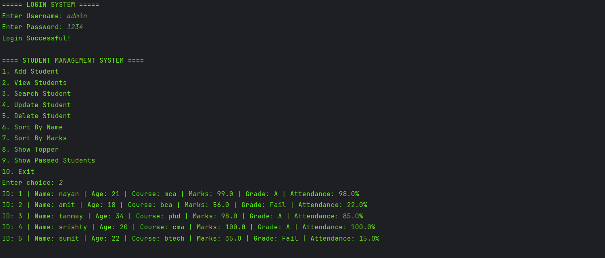

# Student Management System (Core Java)

A console-based Student Management System built using Core Java.

## Features

- Add Student
- View Students
- Search Student
- Update Student
- Delete Student
- Login Authentication
- Attendance Management
- Grade Calculation
- Sorting Students
- File Handling
- Data Auto Save & Load
- Stream API & Lambda Functions
- Exception Handling & Validation

## Technologies Used

- Java
- OOP
- Collections Framework
- File Handling
- Stream API
- Lambda Expressions

## Project Structure

src/
│
├── model/
├── services/
├── util/
├── data/

## Concepts Covered

- OOP Concepts
- Encapsulation
- Constructor
- ArrayList
- CRUD Operations
- File Handling
- Exception Handling
- Sorting & Searching
- Stream API
- Lambda Functions

## Sample Login

Username: admin
Password: 1234

## Future Improvements

- JDBC Integration
- PostgreSQL Database
- GUI using Swing
- Spring Boot REST API
## Output

## Author

Nayan Deep Joshi
